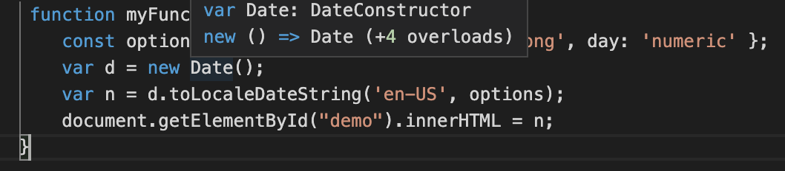
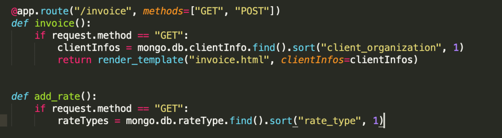

# Invoicing Application – Testing details

[Main README.md file](README.md)

[View website on Heroku](https://katjas-invoicing-app.herokuapp.com/)

## Testing
To check the validity of HTML, CSS, JavaScript, and Python code, I used **[W3C CSS Validation](https://jigsaw.w3.org/css-validator/)**, **[W3C Markup Validation](https://validator.w3.org/)**, **[JSHint](https://jshint.com/)**, and **[PEP8 online](http://pep8online.com/)**.


### Client stories testing:
Due to the very specific nature of the application, there are two kinds of users for this application: existing ones and new ones. Seamless access for both groups was tested during the testing process.

#### Testing client stories from UX section of README.md
1. As a new user of the application, I want to be able to easily register and start using the applilication.
    1. The Login page appears upon navigating to the URL of the application, with the link to the registration displayed both at the bottom of the page and in the navbar.
    2. Registration information is validated upon entry.
    3. Upon successful registration, the new user is directed to the profile page with information about the application functinality and where to find it.

2. As an existing user of the application, I want to be able to manage my client information and easily create ready-to-share invoices
    1. The Login page appears upon navigating to the URL of the application.
    2. Login information is validated upon entry.
    3. Upon successful registration, the new user is directed to the profile page with information about the application functinality and where to find it.
    4. In addition to the explanation on the profile page, all functionality is accessible through the navbar through appropriately labelled items.


### Manual (logical) testing of all elements and functionality on every page.
#### Login Page
1. Navigage to the "Login" page from a desktop computer.
2. Using both Firefox Developer Tools and different devices: Look at the login on a desktop screen, a tablet screen, and a phone screen to verify that the navigation bar turns into a burger menu when navigating to the login on a tablet or a phone screen.
3. Click on the logo in the navigation bar and verify that it links back to the Login page.
4. Verify that only the Registration and Login items are visible in the navbar to users who are not logged in.
5. Click on each navbar item and the registration link at the bottom of the screen and verify that it links to the correct page.
6. Repeat steps 4 and 5 on phone and a tablet.
7. Log in with an existing user account and test if the form rejects a non-existing username and a wrong password.

#### Registration Page
1. Navigage to the "Registration" page from a desktop computer by using either the link at the bottom of the login page or the navbar item.
2. Using both Firefox Developer Tools and different devices: Look at the registration on a desktop screen, a tablet screen, and a phone screen to verify that the navigation bar turns into a burger menu when navigating to the registration on a tablet or a phone screen.
3. Click on the logo in the navigation bar and verify that it links back to the Login page.
4. Verify that only the Registration and Login items are visible in the navbar to users who are not logged in.
5. Click on each navbar item and the login link at the bottom of the screen and verify that it links to the correct page.
6. Repeat steps 4 and 5 on phone and a tablet.
7. Register a new user account and test if the form rejects invaldi input.

#### Add Client Page
1. Enter new client information and test if the form provides an error message in response to trying to submit the an incomplete form.
2. Submit the form.

#### Manage Clients Page
1. Click the **Delete** button to test if the selected entry was deleted.
2. Click the **Edit** button to test if the user is directed to the edit client information page.

#### Edit Client Page
1. Enter new client information and test if the form provides an error message in response to trying to submit the an incomplete form.
2. Submit the form.
3. Cancel the editing process and test if the user gets sent back to the manage clients page.

#### Invoice Page
1. Select cliet orgnization and test if the remaining client field populate automatically.
2. Fill out work details and test if the text input fields are functional
3. Test out the dropdown menaus for interpreting jobs, coordination/consulting, and rates and test if they populate correctly, including an empty option, and if the total amount gets added correctly.

#### Profile Page
1. Click the links to test if the link to the correct pages. 


## Bugs Discovered


### JavaScript Date Shown in the Wrong Format
- Using the JavaScript ``Date()`` constructor, the date at the to of the invoice template did not appear in the desired format.

- Using a customized function that including a location setting allowed me to set the date to standard U.S. format, i.e., the format of the region where the app will be used:

<figure align="left">
    
    <figcaption>JavaScript code of a customized date function used to display the current date in U.S. standard format</figcaption>
</figure>


### List of Clients Disappared

- At one point, the list of clients on the manage clients page completely disappeared.

- Using Google Developer Tools, I discovered the following:

 ```list``` in ```clientInfo``` had been missing. Below the fixed code:\
```@app.route("/get_clientInfo")```\
```def get_clientInfo():```\
&nbsp;&nbsp;&nbsp;&nbsp;&nbsp;&nbsp;&nbsp;&nbsp;```clientInfo = list(mongo.db.clientInfo.find())```\
&nbsp;&nbsp;&nbsp;&nbsp;&nbsp;&nbsp;&nbsp;&nbsp;```return render_template("clientInfo.html", clientInfo=clientInfo)```\


### Failure to Display Multiple Dropdown Menus on the Same Page
- Initially, I did not magage to display several different dropdown menus on the invoice page. This is the code I was usinng:

<figure align="left">
    
    <figcaption>Python code that did not allow me to display more than one dropdown menu on the invoice page</figcaption>
</figure>


### Buttons on Edit Client Page Not Centered on iPad
- During initial testing of responsiveness, the buttons on the editc client page were not centered on iPad screens.
- I solved the problem by writing my own CSS code instead of using the Materialize styling.


### JavaScript Function at the Bottom of Invoice Page not Adding Amounts
- Initially, the field for the total remained blank even after selecting amount from the dropdown menus.
- Through Google research I realized that I needed to save the rates in the Int64 format, not as strings, in MongoDB.